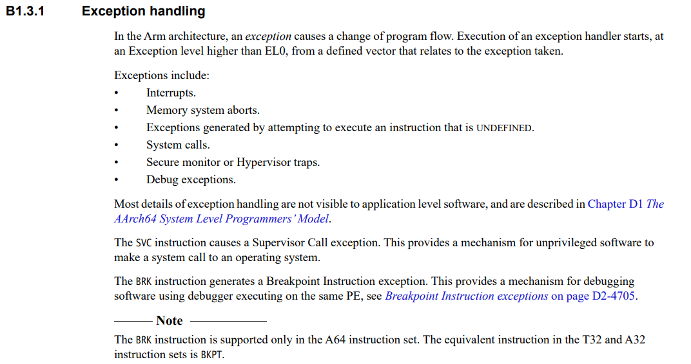
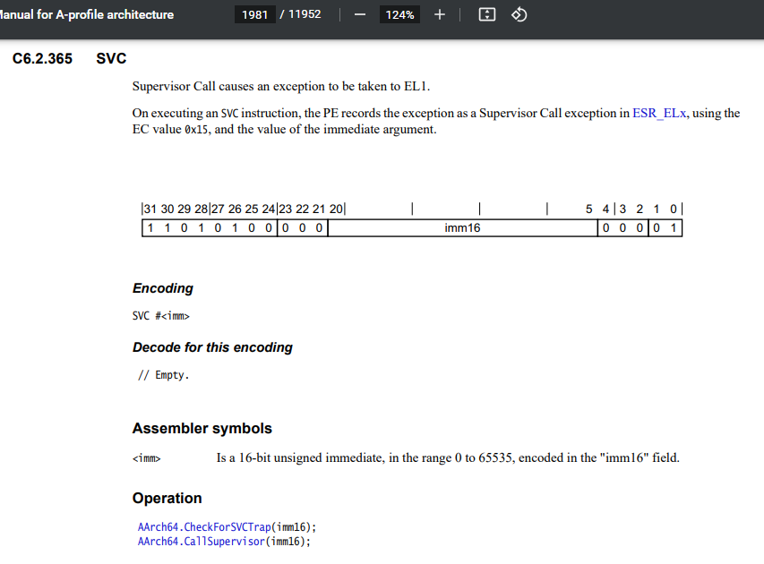
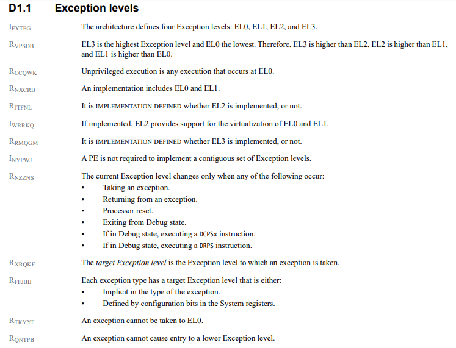

Visto que o pdf tem 12 mil paginas. Vou escrever aqui o conteudo do material mencionado
## Part B The AArch64 Application level architecture
## Chapter B1 - The AArch64 Application Level Programmer's model
# B1.3.1 (pag 146 pdf) - Software control features and ELO

## Part C The AArch64 Instruction Set
## Chapter C6 - A64 base instructions
## C6.2 Alphabetical list of A64 base instructions
# C6.2.365 (pag 1981 pdf)

## Part D The AArch64 System Level Architecture
## Chapter D1 The AArch64 System Level Programmers Model
# D1.1 Exception levels (pag 4632 pdf)

# Documentação syscall
- https://man7.org/linux/man-pages/man2/syscall.2.html

# Respostas às questões
## Como se indica qual a chamada de sistema a executar?

> Seguindo a documentação de Linux, e para processadores ARM64, o comando a executar é "svc #0", com o registo "x8" que contém o número da chamada de sistema

## Como são passados os argumentos e onde é devolvido o valor de retorno?

> Os argumentos são passados através dos registos "x0" a "x5" e o valor de retorno em "x0" e "x1". [Ref](https://man7.org/linux/man-pages/man2/syscall.2.html#:~:text=arm64%20%20%20%20%20%20%20%20%20x0%20%20%20%20x1%20%20%20%20x2%20%20%20%20x3%20%20%20%20x4%20%20%20%20x5%20%20%20%20%2D)

## Como se provoca a transição do código da aplicação para o código do kernel e que nível se altera no processador?

> Usando a instrução "SVC", causamos uma exceção que eleva o nível de exceção para EL.1, nível este onde corre o Kernel
